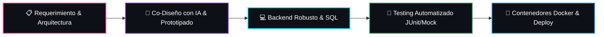

<div align="center">
  <!-- Banner principal con gradiente radical / cyber -->
  
</div>

<div align="center">
  <!-- Subtítulo dinámico animado -->
  
</div>

<div align="center">
  <br/>
  <a href="https://portafolio-leonardo-hernandez.netlify.app/" target="_blank">
    
  </a>
  &nbsp;
  <a href="https://www.linkedin.com/in/leonardo-hernández-2a6a66389" target="_blank">
    
  </a>
  &nbsp;
  <a href="mailto:lehernan.07@gmail.com">
    
  </a>
  &nbsp;
  <a href="https://github.com/Leonardo4516?tab=repositories">
    
  </a>
</div>

<br/>

---

### 👨‍💻 Sobre mí

```yaml
desarrollador:
  nombre: "Leonardo Hernández"
  perfil: "Backend Developer & AI-Assisted Programmer"
  enfoque: "Arquitecturas modulares, bases de datos relacionales y microservicios"
  co_piloto_ia:
    estrategias: ["Prompt Engineering", "Agentes Autónomos", "Orquestación con LLMs"]
    impacto: "Aceleración de ciclos de entrega, pruebas automatizadas y refactorización continua"
  stack_principal: ["Java", "Node.js", "Python", "PostgreSQL", "Docker", "n8n"]
  disponibilidad: "Abierto a proyectos de alto impacto e ingeniería backend"
```

> 💡 **Filosofía:** *Combino el rigor de la arquitectura backend tradicional con el potencial de la Inteligencia Artificial para construir software robusto, mantenible y preparado para escalar.*

* 🔭 **Enfoque actual:** Profundizando en seguridad de APIs (RBAC), arquitecturas limpias y orquestación de flujos de eventos con **n8n**.
* 🤖 **Integración de IA:** Uso activo de LLMs como copiloto de desarrollo: modelado ágil, revisión defensiva de código y pipelines de automatización.
* 💬 **Hablemos de:** Optimización en SQL/PostgreSQL, diseño backend escalable y automatizaciones inteligentes.
* 📫 **Email:** [lehernan.07@gmail.com](mailto:lehernan.07@gmail.com)

---

### 🛠️ Ecosistema & Stack Tecnológico

<div align="center">
  <table border="0">
    <tr>
      <td align="center" width="50%">
        <b>☕ Backend & Lenguajes</b>
        <br/><br/>
        
      </td>
      <td align="center" width="50%">
        <b>🗄️ Bases de Datos & DevOps</b>
        <br/><br/>
        
      </td>
    </tr>
    <tr>
      <td align="center" colspan="2">
        <br/>
        <b>🌐 Frontend & Web Platform</b>
        <br/><br/>
        
      </td>
    </tr>
  </table>
</div>

<br/>

<div align="center">
  <b>⚡ Inteligencia Artificial, Automatización & Calidad</b>
  <br/><br/>
  
  &nbsp;
  
  &nbsp;
  
  &nbsp;
  
  &nbsp;
  
</div>

<br/>

---

### ⚙️ Flujo de Ingeniería & Metodología



---

### 📊 Métricas & Actividad en GitHub

<div align="center">
  <table border="0" width="100%">
    <tr>
      <td align="center" width="50%">
        <a href="https://github.com/Leonardo4516">
          
        </a>
      </td>
      <td align="center" width="50%">
        <a href="https://github.com/Leonardo4516">
          
        </a>
      </td>
    </tr>
  </table>
</div>

---

### 🚀 Proyectos Destacados

<div align="center">
  <table border="0" width="100%">
    <tr>
      <td width="50%" align="center">
        <a href="https://github.com/Leonardo4516/Sica_project">
          
        </a>
      </td>
      <td width="50%" align="center">
        <a href="https://github.com/Leonardo4516/volcado-datos-postgresql">
          
        </a>
      </td>
    </tr>
    <tr>
      <td width="50%" align="center">
        <a href="https://github.com/Leonardo4516/chatbot-gestor-pedidos">
          
        </a>
      </td>
      <td width="50%" align="center">
        <a href="https://github.com/Leonardo4516/acme-bank">
          
        </a>
      </td>
    </tr>
  </table>
</div>

<br/>

| Proyecto | Descripción & Aspectos Clave | Stack Tecnológico | Repositorio |
| :--- | :--- | :--- | :---: |
| 🛡️ **Sica Project** | **Control de Acceso Vehicular & Peatonal**<br/>• Seguridad basada en roles (RBAC)<br/>• Persistencia relacional en Docker Compose<br/>• Suite de pruebas unitarias automatizadas con JUnit 5 | <br/><br/><br/> | [Ver Código ↗](https://github.com/Leonardo4516/Sica_project) |
| 🗄️ **Data Pipeline PostgreSQL** | **Volcado, Normalización y Calidad de Datos**<br/>• Ingesta masiva y validación de esquema geográfico (`world_db`)<br/>• Lógica de integridad referencial y funciones PL/pgSQL<br/>• Entorno de ejecución desacoplado en contenedores | <br/><br/> | [Ver Código ↗](https://github.com/Leonardo4516/volcado-datos-postgresql) |
| 🤖 **Chatbot Gestor de Pedidos** | **Automatización Conversacional Asistida por IA**<br/>• Asistencia conversacional para gestión y checkout de pedidos<br/>• Orquestación de flujos y webhooks mediante n8n<br/>• Desacoplamiento de reglas de negocio en Node.js | <br/><br/> | [Ver Código ↗](https://github.com/Leonardo4516/chatbot-gestor-pedidos) |
| 🏦 **Acme Bank** | **Portal Transaccional Bancario**<br/>• Simulación completa de operaciones y validación en tiempo real<br/>• Arquitectura modular con Web Components nativos<br/>• Persistencia transaccional segura en cliente (Storage API) | <br/><br/> | [Ver Código ↗](https://github.com/Leonardo4516/acme-bank) |

<br/>

---

### 💡 Filosofía de Ingeniería

<div align="center">
  
  
  <br/><br/>

  <a href="https://portafolio-leonardo-hernandez.netlify.app/" target="_blank">
    
  </a>
  &nbsp;
  <a href="https://www.linkedin.com/in/leonardo-hernández-2a6a66389" target="_blank">
    
  </a>
  &nbsp;
  <a href="mailto:lehernan.07@gmail.com">
    
  </a>
  &nbsp;
  <a href="https://github.com/Leonardo4516">
    
  </a>

  <br/><br/>
  <!-- Pie de página fluido con gradiente invertido -->
  
</div>
